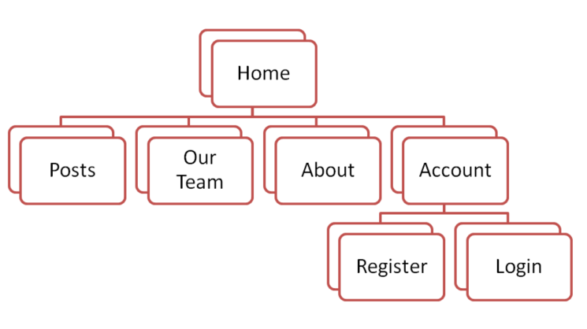
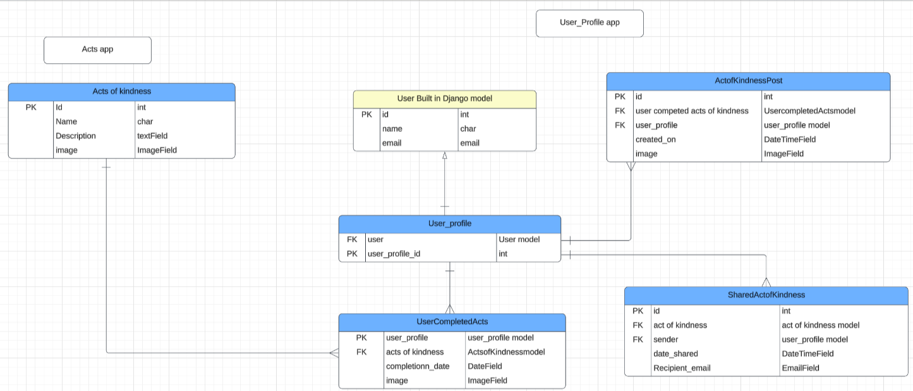
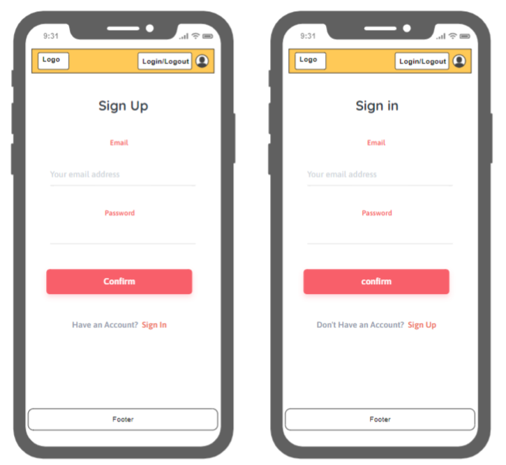

 

    <h1 align="center"><strong> Happiness Unleashed</strong></h1>
    
 The app inspiring you to do more good 

      

## Deployment

The project is deployed and can be accessed at https://happiness-unleashed-b388dd1f8f63.herokuapp.com/

## Criteria
In this section, we will briefly discuss how our team addressed the applicable criteria:
-  CSS framework Bootstrap was used to built our user-friendly design
-  GitHub Project includes user stories and a detailed README.md; https://github.com/users/HMuraja/projects/7/views/1
-  We came up with a application to remind, engage and motivate the user to act kind in their daily live
-  Project demonstrates responsiveness, accessibility, and thorough testing
-  Beyond standard requirements these are our more innovative features/functionalities: create user accounts, create individual user posts, create own acts of kindness  
-  As a team we worked together in on respository, splitted task according to interest and skills
    - Backend focus: Stephen, Ann
    - Frontend focus: Felipe, Claudio
    - content creation, images and documentation: Soundarya, Florian
    - Scrum Master: Hilla

# ABOUT SUBMISSION
## Intro
Welcome to Happiness Unleashed! In a busy world where everyone's got a lot on their plate, being kind can sometimes get lost in the shuffle. That's where the Happiness Unleashed stands out as a guiding light. It's easy to feel overwhelmed by the demands of our schedules or the complexities of the world around us, but kindness has the power to break through these barriers.

Picture this: in a world where everyone is rushing to meet deadlines, fulfill obligations, and chase success, a single act of kindness can make someone's day better. Whether it's a genuine smile, a helping hand, or a nice gesture, these small acts can uplift spirits, foster connection, and create ripple effects of positivity.

We wanted to allow our users to spread a sense of happiness by using our happiness-unleashed challenges that inspire others to pay it forward. Imagine the happiness you feel after making someone smile, knowing you've made a difference, and the happiness that comes from spreading kindness. Let's challenge ourselves to break free from the busyness and self-absorption of modern life.

Together, we can make the world a brighter, happier place where each of us has the power to unleash waves of happiness and countless smiles. 

## Goal
Our app aims to make kindness a daily habit by offering simple challenges that inspire users to turn their good intentions into actions.

- ➡️ Problem: In a world where kindness is plentiful but easily overlooked in the chaos of everyday life, our app provides a platform for users to share their acts of kindness, sparking a chain reaction of positivity.
- ➡️ Objective: We provide an application that fosters and simplifies kindness and happiness and can be integrated easily within our daily rountine.
- ➡️ Target Audience: People who are willing to include more happiness and kindness in their world by using smart applications.
- ➡️ Benefits: By promoting kindness, our app can create a more compassionate and connected community, where individuals feel happier and more fulfilled.

## Tech
"Happiness Unleashed" is crafted using a blend of powerful technologies including Django for robust backend functionality, Bootstrap for sleek and responsive frontend design, and a mix of HTML, CSS, Python, and JavaScript to deliver a seamless and joyful user experience.

Image storage: Cloudinary
Technologies: HTML, CSS, Python, [Django]( https://github.com/django/django), [Bootstrap](https://getbootstrap.com/docs/5.3/layout/containers/)
Deployment Platform: Heroku 

## Structure:
The site's structure is visually represented within the navigation bar. It encompasses various sections, starting with the "Home" landing page, which actively encourages user engagement by proposing four distinct acts of kindness.

Within the "Posts" section, users can view posts to sustain their motivation. The "Our Team" segment showcases the developer team behind the platform. In the "About" section, users find a detailed explanation of the application's purpose and the developers' underlying motivations.

Lastly, the "Account" section facilitates user authentication, providing options for logging in or signing up. Once authenticated, users gain access to a personalized view, where they can track their own completed acts of kindness.

The structure of models form a database perspective is shown in the following:

## Wireframes
Here are shwon a few wireframes we used to set up the subpages. During the project slight adjustments has been made.

## Testing

- user interface/ experience testing
- url testing, internal, external
- test form submit
- content 
- responsiveness
- accessability
- images have alt types, aria labels

## Credits
In the credits section, we provide information about the sources we have used during the project:
- canva
- Am I Responsive
- image source: https://unsplash.com/, https://www.freepik.com/
- favicon generator: https://favicon.io/
- templates/ frameworks i.e. https://app.box.com/s/r356kxmp3yiwa96evgmpera7il9t4xyg
